# Rux Robot Test Documentation
Documentation of what I tried out with and can find out about Rux Robot by LeTianPai.

# Switching from Android to Linux Debian
Based on [Android/Linux Debian Dual System Switching Tutorial](https://global.letianpai.com/all/?p=1675&v=8528837ceeea) and [Flashing Tutorial for Full ROOT Version](https://global.letianpai.com/all/?p=1680&v=8528837ceeea) by LeTianPai.

## Flashing ROM with full root access (Windows)
The offical [Flashing Tutorial for Full ROOT Version](https://global.letianpai.com/all/?p=1680&v=8528837ceeea) was described for Windows 11. I tested it with Windows 10 and it worked as well. Parts of the flashing programs are in Chinese, so I used Google 

In this step the standard firmware (ROM) is exchanged (flashed) with a new firmware that allows full access to the system.

### Download flashing tools and system image
Download and unzip the three files *RKDevTool_Release_v2.95.zip*, *update.img.zip* and *驱动包-DriverAssitant_v5.1.1.zip* via the download links in the [Flashing Tutorial for Full ROOT Version](https://global.letianpai.com/all/?p=1680&v=8528837ceeea).


### Install (ADB?) Driver
Go to the *DriverAssitant_v5.1.1* directory and start the program *DriverInstall.exe* . Click 'Install Driver' and wait for the installation to finish. Then click 'OK' and close the Driver Assistant.

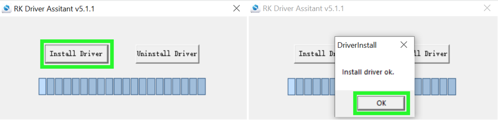

### Install Firmware
Go to the *RKDevTool_Release_v2.95* directory and start the program *RKDevTool.exe*. This program is in Chinese regardless of your system language (left side). I translated it with Google Images to see what's happening (right side).

Go to "Upgrade Firmware" tab.

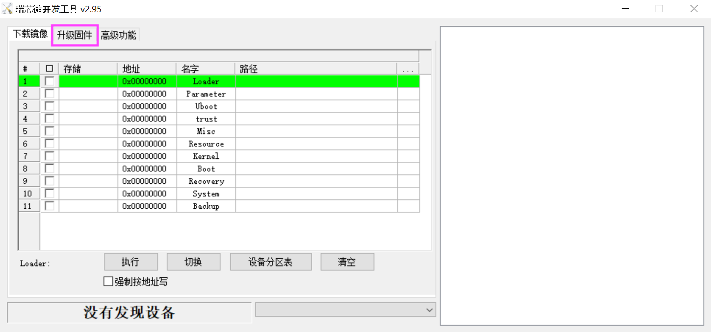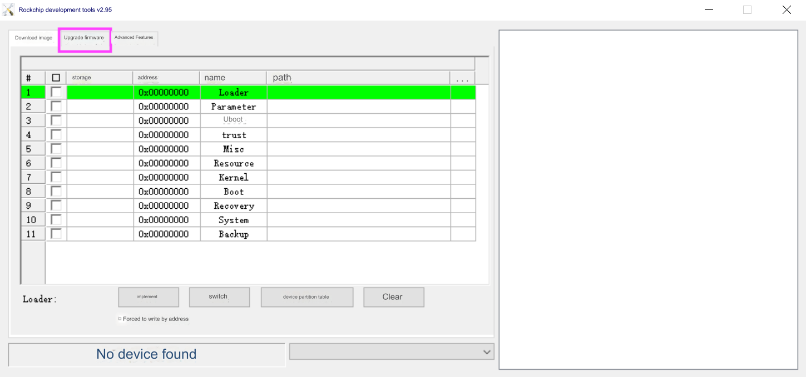

Click "Firmware" to open a file browser.

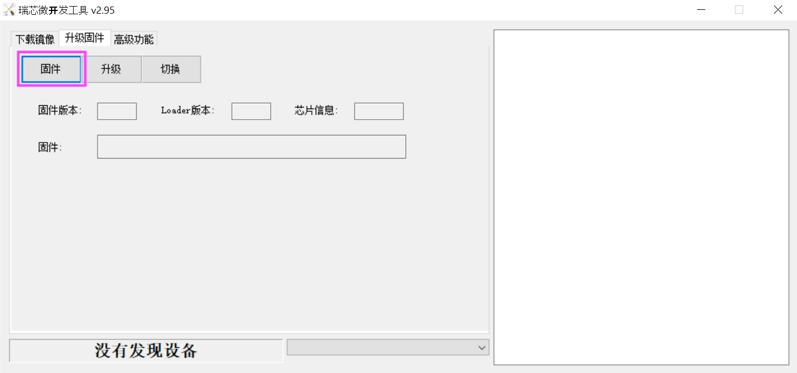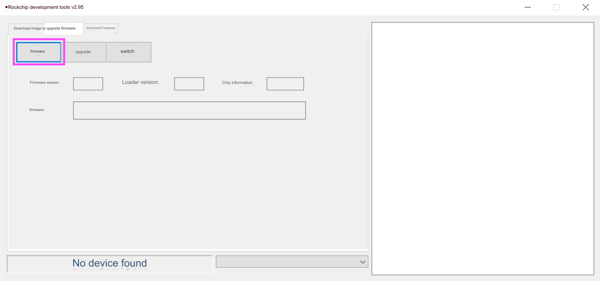

Go to the *update.img* directory, select the update image and click "Open".

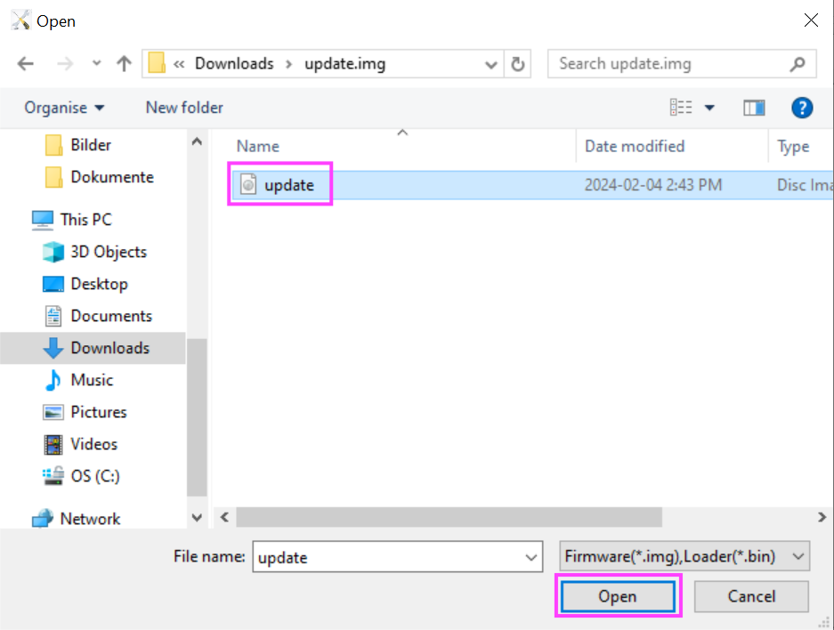

The path to the selected update image is shown in the flashing tool window.
**NOW: Connect the robot to the computer via the provided USB cable**
The word “Found an ADB device” appears at the bottom of the flashing tool window, and it is now time to flash the device.

Click "Switch" to enter the flashing mode.

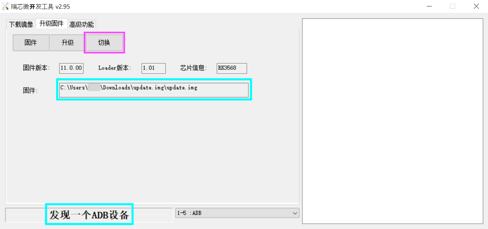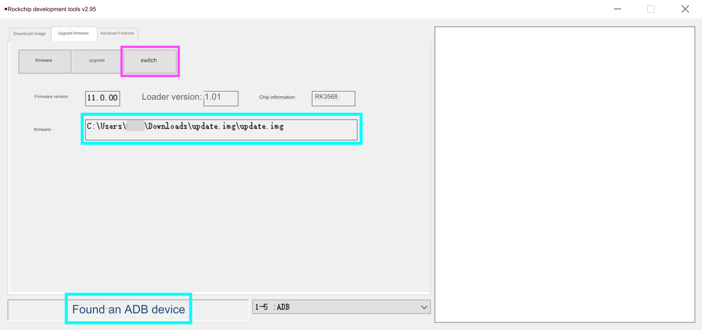

Wait for the display on the right to show that the RockUSB switch is successful. At this time, the device is already in a screen rest state.
Wait for a few seconds, and the word “Found a LOADER device” will appear at the bottom of the window.

Click "Upgrade" to  start flashing the device.

:bangbang: Be careful not to touch the device and USB cable at this time, and maintain a stable connection state (otherwise it may cause interruption of flashing)

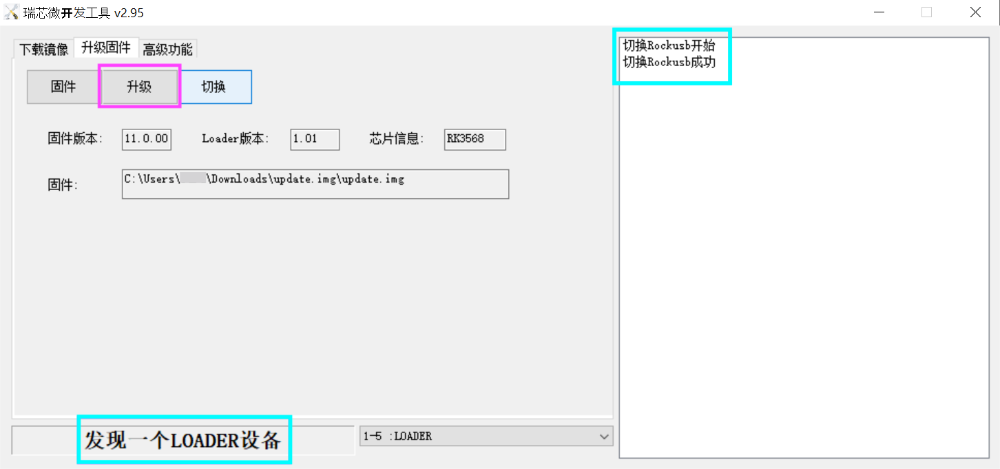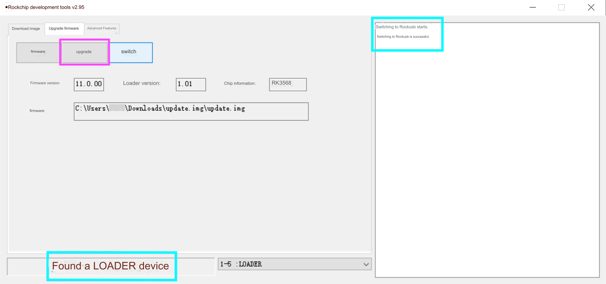

The upgrade record is displayed on the right side of the tool. When it shows that the firmware download is 100% successful, the flashing is complete.

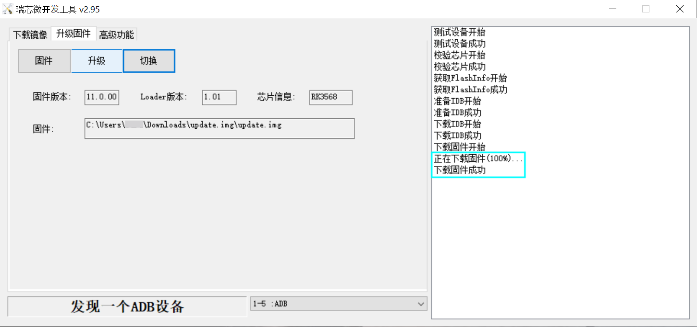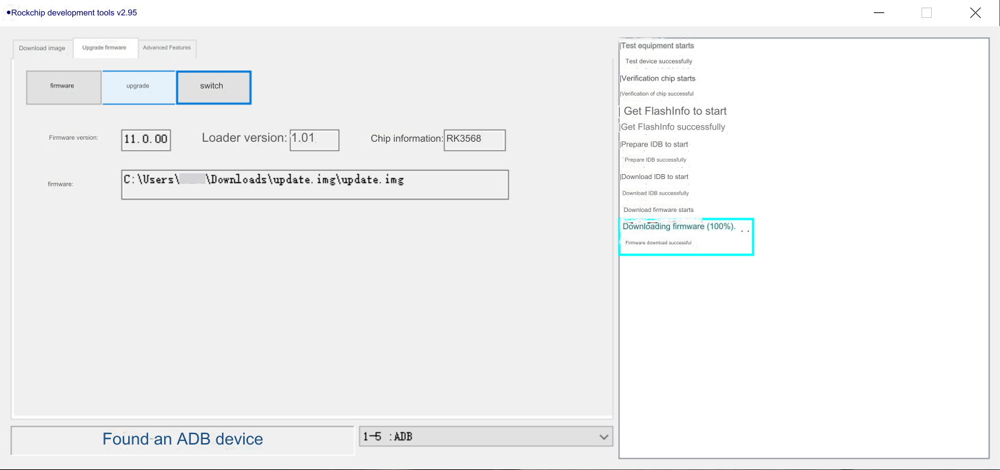

I waited until the robot rebooted and displayed the QR code screen it showed when you started the robot for the very first time. Then I closed the firmware tool, ejected the robot "device" and disconnected the cable.

## Prepare ADB Tools (macOS)
**1. Install Android Studio**

**2. Find where Android SDK is installed**
for me it was this directory: `/Users/<user_name>/Library/Android/sdk`
[*StackOverflow:* Finding Android SDK on Mac and adding to PATH](https://stackoverflow.com/questions/34532063/finding-android-sdk-on-mac-and-adding-to-path)

**3. Add ADB tools to your PATH**
Start a new shell.

1. open shell profile (`.bash_profile` in my case) `open -e  $HOME/.bash_profile`

2. add PATH to the end of the file and save

    ```bash
    export ANDROID_HOME="$HOME/Library/Android/sdk/"
    export PATH="$ANDROID_HOME/tools:$ANDROID_HOME/tools/bin:$ANDROID_HOME/platform-tools:$PATH"
    ```
3. run `source ~/.bash_profile`

**4. Check if adb command is working**
Open a new shell tab and enter this to see if it shows the function description:

```sh
cd ~/Library/Android/sdk/platform-tools/
adb
```

If there's a `command not found` error `adb` is not in the PATH yet, where the shell looks for executables. 
[*StackOverflow:* Not able to access adb in OS X through Terminal, "command not found"](https://stackoverflow.com/questions/7609270/not-able-to-access-adb-in-os-x-through-terminal-command-not-found)

## Switch between Android and Linux (macOS)
First connect the robot to the computer via USB cable.

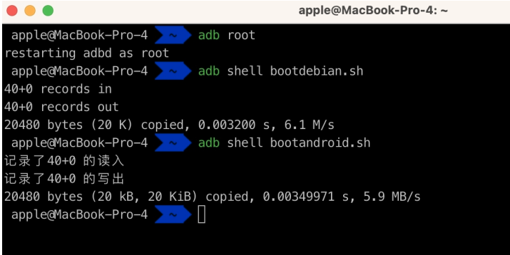

### From Android to Linux
Start a new shell and enter:

```sh
adb root
adb shell bootdebian.sh
```
Wait for the robot to finish. It will show a home screen on its display when it's done.

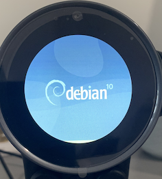

### From Linux to Android
Start a new shell and enter:

```sh
adb shell bootandroid.sh
```
Wait for the robot to finish. It will go back to its normal Rux screen.

### :bangbang: Precautions for Linux system operation

When the robot switches to running Linux system through ADB command, if the data cable is unplugged and then plugged in, the computer will not be able to recognize the robot through ADB. You need to use a card needle, press the reset hole on the back for 5 seconds to force the device to shut down, then connect the computer and robot with a data cable and turn it on again to recognize it normally;
Linux system is a native system that provides developers with the maximum customization ability, and developers need to develop corresponding drivers themselves.
